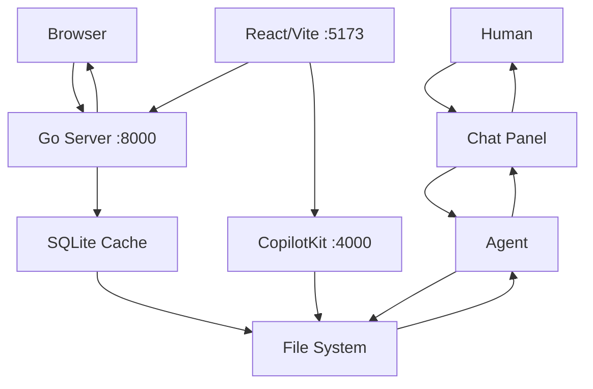

# System Architecture

devtop is a single-process Go web server with a React frontend and SQLite-backed file synchronization.

## Core Stack

- **Go 1.25** — `net/http` with Go 1.22+ routing patterns (`GET /docs/{slug...}`)
- **SQLite** — via `glebarez/go-sqlite` (pure Go, no CGo), used as a cache layer over the filesystem
- **Alpine.js 3.x** — lightweight SPA in `base.html` served by Go (default UI)
- **React 19 + TypeScript 6** — separate frontend in `frontend/` built with Vite 8 and CopilotKit
- **Tailwind CSS** (CDN) — utility-first styling
- **Mermaid 11** — diagram rendering in docs
- **File system** — the primary data store; SQLite is a read cache synced from files

## Data Flow



## Key Modules

| Module | Responsibility |
|--------|---------------|
| `main.go` | Server setup, routing, file watcher, entry point |
| `handlers.go` | HTTP handlers (page routes + API routes, SSE chat) |
| `agent.go` | AI agent engine (tool registry, LLM streaming, depth-limited recursion) |
| `db.go` | SQLite database layer (documents, tickets, threads CRUD) |
| `sync.go` | Filesystem ↔ DB sync (MDX parsing, YAML frontmatter, rendering) |
| `models.go` | AI model cache (fetch from API, cache to disk) |
| `mcp.go` | MCP (Model Context Protocol) server integration |
| `frontend/` | React + Vite + CopilotKit UI (port 5173, proxies to Go :8000) |

## Agent Tool Set

- `read_doc(path)` — Read a documentation file
- `write_doc(path, content)` — Write or update documentation
- `list_docs()` — List all available documentation files with their slugs/paths and titles
- `list_tickets()` — List all tickets
- `read_ticket(id)` — Read a single ticket
- `create_ticket(title, description, priority, assignee)` — Create a ticket
- `update_ticket(id, status, priority, assignee)` — Update a ticket
- `add_comment(id, body)` — Add a comment to a ticket
- `git_commit(message)` — Commit all changes to git
- `ask_user(question)` — Ask the user for clarification

## Auto-Commit

Every write operation is automatically committed to git. The commit messages follow conventional commit format:

```
docs: add architecture overview with mermaid diagram
tickets: update dk-001 status to in-progress
tickets: create dk-004 for search feature
```

## MCP Integration

The agent can connect to external MCP servers (configured via `MCP_SERVERS` env var) to extend its toolset. Supports `stdio` and `streamable-http` transports — tool definitions are dynamically converted to OpenAI-compatible function schemas.

## Deployment

```bash
# Production Docker (multi-stage Go build -> Alpine)
docker build -t devtop:latest .
docker run -v $(pwd):/workspace -p 8000:8000 devtop:latest

# Dev Docker (Go + Air hot-reload + Node)
docker build -f Dockerfile.dev -t devtop:dev .
docker run -v $(pwd):/app -p 8000:8000 -p 5173:5173 devtop:dev
```