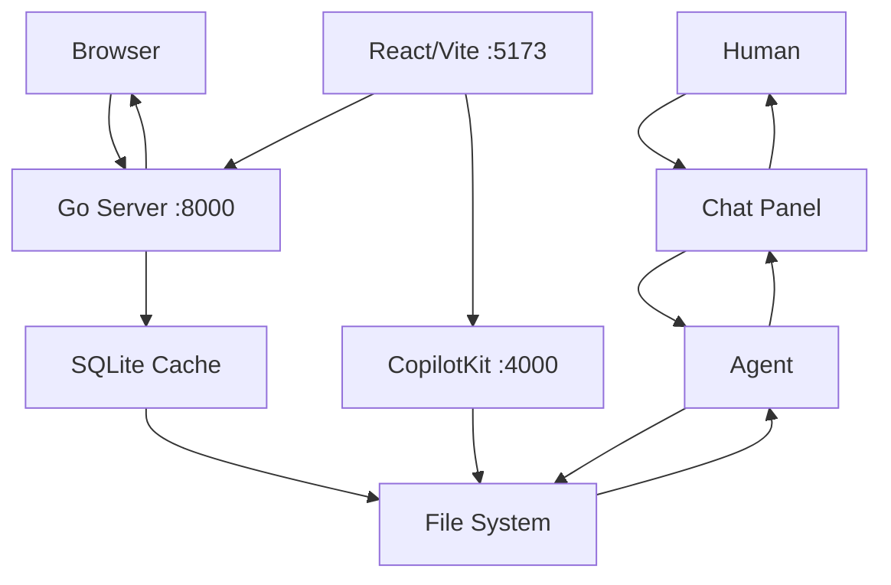

# System Architecture Overview

devtop is a single-process Go web server with a React frontend and SQLite-backed file synchronization.

## Core Stack

- **Go 1.25** — `net/http` with Go 1.22+ routing patterns (`GET /docs/{slug...}`)
- **SQLite** — via `glebarez/go-sqlite` (pure Go, no CGo), used as a cache layer over the filesystem
- **Alpine.js 3.x** — lightweight SPA in `base.html` served by Go (default UI)
- **React 19 + TypeScript 6** — separate frontend in `frontend/` built with Vite 8 and CopilotKit
- **Tailwind CSS** (CDN) — utility-first styling
- **Mermaid 11** — diagram rendering in docs
- **File system** — the primary data store; SQLite is a read cache synced from files

## Data Flow



## Project Structure

```
.devtop/
├── docs/           # MDX documentation files
├── tickets/        # Markdown ticket files with YAML frontmatter
├── threads/        # Chat thread storage (JSON)
└── data/           # Cached models and metadata
```