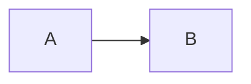

# Writing Documentation

## File Format

All documentation uses the MDX format — YAML frontmatter with markdown body:

```mdx
---
title: "My Document"
---

# My Document

Content written in standard Markdown or MDX.

## Diagrams

Use Mermaid code blocks:


```

## Conventions

- Use `.mdx` extension
- Always include a `title` field in frontmatter
- Place files in the appropriate subdirectory under `docs/`
- Use sentence case for titles

## Reading from the Agent

The agent can read any doc with `read_doc(path)` where path is relative to `docs/`. Example:

```
read_doc("architecture/overview.mdx")
```