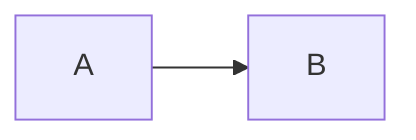

# Writing Documentation

## File Format

All documentation uses the MDX format — YAML frontmatter with markdown body:

```mdx
---
title: "My Document"
---

# My Document

Content written in standard Markdown or MDX.

## Diagrams

Use Mermaid code blocks:


```

## Conventions

- Use `.mdx` extension
- Always include a `title` field in frontmatter
- Place files in the appropriate subdirectory under `docs/`
- Use sentence case for titles

## Reading from the Agent

The agent can read any doc with `read_doc(path)` where path is relative to `docs/`. Example:

```
read_doc("architecture/agent-engine.mdx")
```

To see how a doc looked at a past commit, use `read_doc_at(path, commit)` (commit can be a full or short sha, or `HEAD`). `list_doc_revisions(path)` returns every commit that changed the doc, newest first, with `sha`, `message`, `author`, and `date`. In the web UI the same history is browsable from the clock button in the header — it opens a per-doc revision rail backed by git.

Because every agent write auto-commits (`git_commit`), docs are always versioned: changes to a doc are traceable to the conversation that made them.