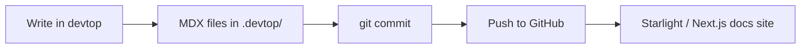

# devtop — Docs + Tickets with AI

A lightweight, file-backed documentation and ticket system with an embedded AI agent. All data is stored as plain MDX/MD files in your project's `.devtop/` directory.

## Quick Start

```bash
# Run locally
go run .

# Or via just
just devtop

# With custom port
go run . -port 8080
```

## Why devtop?

Traditional ticketing systems (Jira, Linear) and documentation tools (Confluence, GitBook) live outside your codebase. devtop lives inside it — docs and tickets are plain MDX/MD files in your repo, version-controllable via git.

## MDX Format

Documentation files use the [MDX](https://mdxjs.com) format — YAML frontmatter with a markdown body. This means they're compatible with Starlight, Next.js, Docusaurus, and other MDX-supporting tools.



## Project Structure

```
.devtop/
├── docs/                       # MDX documentation files
│   ├── index.mdx               # This file — project overview
│   ├── getting-started/        # Installation & configuration
│   │   ├── installation.mdx
│   │   └── configuration.mdx
│   ├── architecture/           # System design & internals
│   │   ├── overview.mdx
│   │   ├── agent-engine.mdx
│   │   ├── data-layer.mdx
│   │   └── frontend.mdx
│   ├── guides/                 # How-to guides
│   │   ├── writing-docs.mdx
│   │   ├── managing-tickets.mdx
│   │   └── agent-workflow.mdx
│   ├── reference/              # Technical reference
│   │   ├── api.mdx
│   │   ├── mcp-integration.mdx
│   │   └── deployment.mdx
│   └── tickets/                # Workflow & conventions
│       └── TRIAGE.mdx
├── tickets/        # Markdown ticket files with YAML frontmatter
├── threads/        # Chat thread storage (JSON)
└── data/           # Cached models and metadata
```

## Core Stack

- **Go** 1.25 — backend server (`net/http` routing, SQLite via `glebarez/go-sqlite`)
- **React 19 + TypeScript 6** — frontend UI (Vite, CopilotKit chat)
- **Alpine.js SPA** — lightweight HTML template served by Go (fallback UI)
- **SQLite** — document/ticket/thread cache synced to filesystem
- **AI/LLM** — OpenAI-compatible API (OpenRouter, LM Studio, etc.)

## Agent Model

Only the agent writes to disk. The web UI is read-only. Every change is automatically committed to git with a descriptive message.

## Commands

| Command | Description |
|---------|-------------|
| `just devtop` | Run server locally |
| `just devtop install` | Download Go dependencies |
| `just devtop init` | Create .devtop/ directory structure |
| `just devtop docker` | Build & run production Docker |
| `just devtop dev` | Build & run dev Docker (hot-reload) |
| `go test ./...` | Run all tests |
| `cd frontend && npm run dev` | Start Vite frontend dev server |