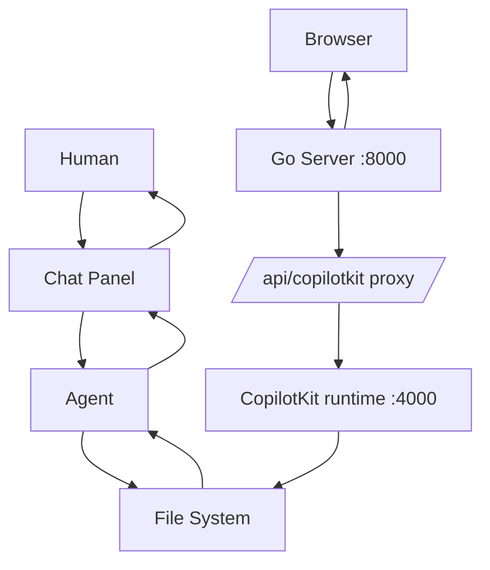

# System Architecture

devtop is a single Go server that serves the React app, the REST API, and a reverse proxy to the CopilotKit AI runtime.

## Core Stack

- **Go 1.25** — `net/http` with Go 1.22+ routing patterns (`GET /api/docs/{slug...}`)
- **React 19 + TypeScript 6** — the only frontend, in `frontend/`, built with Vite 8 into `frontend/dist` and served by Go
- **CopilotKit 1.64** — Node runtime (`frontend/copilot-server.js`) proxied at `/api/copilotkit/*`; runs the AI chat, agent tools, and thread persistence
- **Tailwind CSS 4** — via `@tailwindcss/vite`
- **Mermaid 11** — diagram rendering in docs (CDN + lazily-loaded `MermaidDiagram.tsx`)
- **react-markdown** — client-side rendering (`RichMarkdown.tsx`): `remark-gfm` (tables, task lists) + `rehype-highlight` (code)
- **File system** — the only data store; no database. Raw Markdown + YAML frontmatter files under `.devtop/`

## Data Flow



## Key Modules

| Module | Responsibility |
|--------|---------------|
| `main.go` | Server setup, routing, file watcher, engine-config materialization, entry point |
| `handlers.go` | HTTP handlers (API routes, SPA fallback, CopilotKit proxy, SSE chat) |
| `agent.go` | AI agent engine (tool registry, LLM streaming, depth-limited recursion) |
| `store.go` | File-system CRUD (docs, tickets, threads; YAML frontmatter parsing) |
| `sync.go` | File writes (docs, tickets, threads) |
| `models.go` | AI model cache (fetch from API, cache to disk) |
| `mcp.go` | MCP (Model Context Protocol) server integration |
| `artifacts.go` | Generic artifact endpoints driven by `engine_config.go` |
| `engine_config.go` | `config.yml` loading, kind directory creation |
| `welcome.go` | Fresh-repo welcome doc materialization |
| `frontend/` | React + Vite + CopilotKit UI (dev: :5173, runtime :4000, proxied through Go :8000) |

## Agent Tool Set

- `read_doc(path)` — Read a documentation file
- `write_doc(path, content)` — Write or update documentation
- `list_docs()` — List all available documentation files with their slugs/paths and titles
- `read_workspace_file(path)` — Read a file from the workspace (outside `.devtop/`)
- `list_workspace_files()` — List files in the workspace root
- `list_tickets()` — List all tickets
- `read_ticket(id)` — Read a single ticket
- `create_ticket(title, description, priority, assignee)` — Create a ticket
- `update_ticket(id, status, priority, assignee)` — Update a ticket
- `add_comment(id, body)` — Add a comment to a ticket
- `git_commit(message)` — Commit all changes to git
- `ask_user(question)` — Ask the user for clarification

Plus any tools exposed by configured MCP servers.

## Auto-Commit

Every write operation is automatically committed to git via the `git_commit` tool. Commit messages follow conventional commit format:

```
docs: add architecture overview with mermaid diagram
tickets: update dk-001 status to in-progress
tickets: create dk-004 for search feature
```

## MCP Integration

The agent can connect to external MCP servers (configured via `MCP_SERVERS` env var) to extend its toolset. Supports `stdio` and `streamable-http` transports — tool definitions are dynamically converted to OpenAI-compatible function schemas.

## Deployment

```bash
# Production Docker (multi-stage: Node frontend build -> Go backend -> Alpine runtime)
docker build -t devtop:latest .
docker run --rm -it \
  -v $(pwd):/workspace \
  -v devtop-ai-config:/etc/devtop \
  -p 8000:8000 \
  devtop:latest

# Dev Docker (Go + Air hot-reload + Node)
docker build -f Dockerfile.dev -t devtop:dev .
docker run -v $(pwd):/workspace -p 8000:8000 -p 5173:5173 devtop:dev
```

## Notes

- The old server-rendered (Alpine) frontend, Go templates, and `base.html` were removed — the React app is the only frontend.
- Docs are stored as raw Markdown + frontmatter and served as-is; rendering is client-side (the API returns the file body, never rendered HTML).