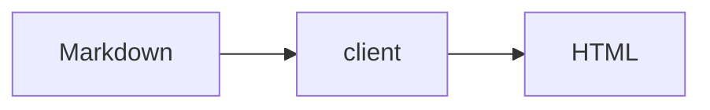

# Rich Rendering

Fixture doc exercising tables, mermaid diagrams, and highlighted code.

## Features

| Feature | Works |
| :------ | :---- |
| Tables | yes |
| Mermaid | yes |
| Code | yes |

## Diagram



## Snippet

```go
package main

func main() {}
```

**Bold** and `inline` code.